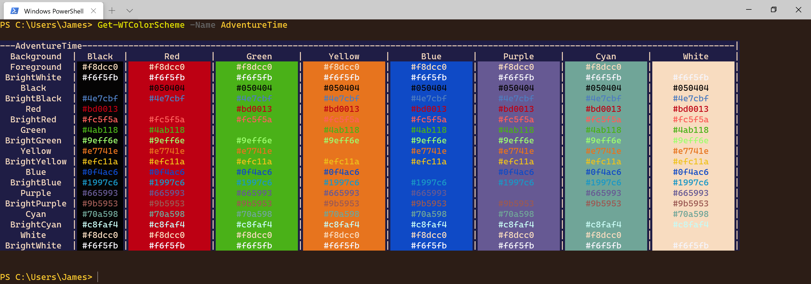


WTX [0.2]
=========

Windows Terminal Extras | Optimize-WindowsTerminal -with PowerShell
---------

### Commands
------------------------
|   Verb|Noun          |
|------:|:-------------|
|    Add|-WTColorScheme|
|       |-WTProfile    |
| Backup|-WTProfile    |
|    Get|-WTColorScheme|
|       |-WTProfile    |
|    New|-WTColorScheme|
|       |-WTProfile    |
| Remove|-WTColorScheme|
|       |-WTProfile    |
|Restore|-WTProfile    |
|    Set|-WTColorScheme|
|       |-WTProfile    |
|   Show|-WT           |
|  Start|-WT           |
|   Stop|-WT           |
------------------------
### WTX is a PowerShell module that lets you customize Windows Terminal.

Here are a few handy things you can do with WTX:

#### Adding a new Profile
~~~
Add-WTProfile -Name kali-linux-pwsh -CommandLine 'wsl -d kali-linux -e pwsh'
~~~

#### Adding a new color scheme
~~~
Add-WTColorScheme -Name AdventureTime
~~~

#### Changing the color scheme
~~~
Set-WTColorScheme -Name AdventureTime -Passthru # The profile is automatically detected.
~~~

#### Starting a new Terminal
~~~
Start-WT -ProfileName PowerShell -CommandLine 'powershell -nologo -noexit -command $psVersionTable'
~~~

~~~
Start-WT -Elevated # Start Windows Terminal Elevated
~~~

#### Flashing an image in Terminal
~~~
# The profile is automatically detected
# The .gif will play once and then dissapear.
Show-WT -ImagePath $home\Pictures\Gif\Whoa.gif 
~~~

#### Preview color schemes
~~~
Get-WTColorScheme AdventureTime # This is formatted by PowerShell to show a preview. 
~~~

