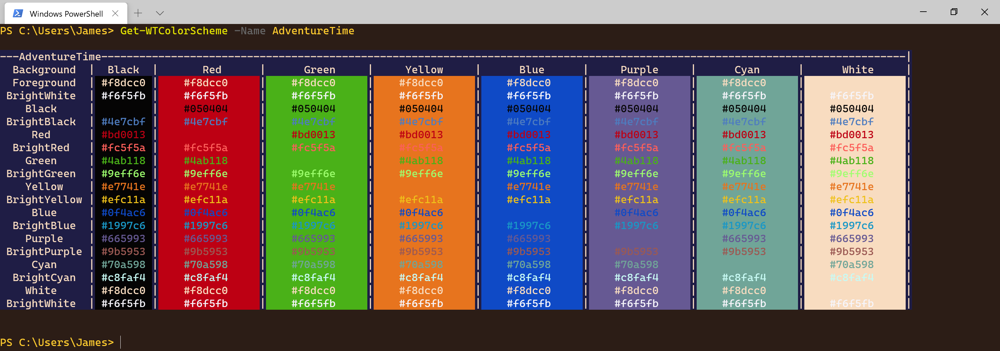

#### Installing

TerminalVelocity is on the PowerShell Gallery.  To Install TerminalVelocity, run:
~~~PowerShell
Install-Module TerminalVelocity -Scope CurrentUser
~~~

Once you've installed TerminalVelocity, here are a few handy things you can do with TerminalVelocity:

#### Adding a new Profile
~~~PowerShell
Add-WTProfile -Name kali-linux-pwsh -CommandLine 'wsl -d kali-linux -e pwsh'
~~~

#### Adding a new color scheme
~~~PowerShell
Add-WTColorScheme -Name AdventureTime
~~~

#### Changing the color scheme
~~~PowerShell
Set-WTColorScheme -Name AdventureTime -Passthru # The profile is automatically detected.
~~~

#### Starting a new Terminal
~~~PowerShell
Start-WT -ProfileName PowerShell -CommandLine 'powershell -nologo -noexit -command $psVersionTable'
~~~

~~~PowerShell
Start-WT -Elevated # Start Windows Terminal Elevated
~~~

#### Flashing an image in Terminal
~~~PowerShell
# The profile is automatically detected
# The .gif will play once and then dissapear.
Show-WT -ImagePath $home\Pictures\Gif\Whoa.gif 
~~~

#### Preview color schemes
~~~PowerShell
Get-WTColorScheme AdventureTime # This is formatted by PowerShell to show a preview. 
~~~

